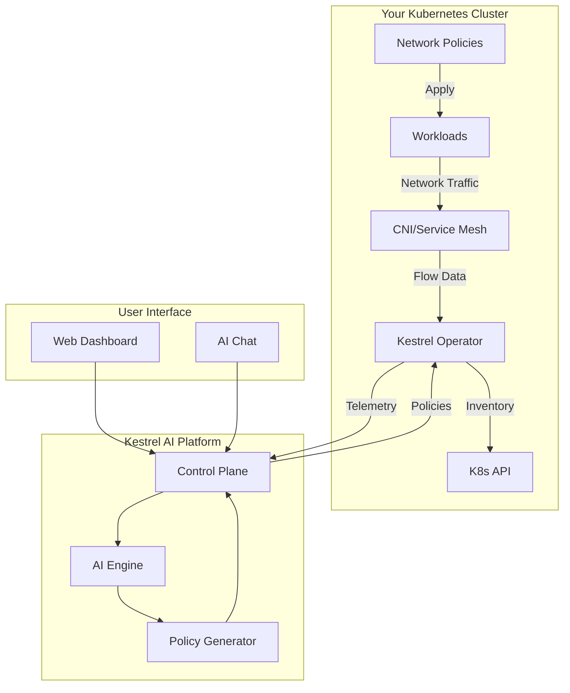

## What is the Kestrel Operator?

The Kestrel Operator is a lightweight Kubernetes agent that bridges your clusters with the Kestrel AI platform. It enables real-time network traffic analysis and AI-powered security policy generation without requiring any changes to your existing applications.

## Key Features

### Network Traffic Visibility
- **Real-time flow collection** from Cilium Hubble or Istio service mesh
- **Zero application changes** required
- **Automatic workload discovery** and inventory management
- **Multi-protocol support** (TCP, UDP, HTTP, gRPC)

### AI-Powered Security
- **Intelligent policy generation** based on observed traffic patterns
- **Automatic anomaly detection** for suspicious connections
- **Continuous learning** from your unique traffic patterns
- **Policy impact analysis** before deployment

### Enterprise-Ready
- **Multi-tenant isolation** for shared clusters
- **Secure authentication** with automatic token renewal
- **TLS encryption** for all communications
- **Resource-efficient** with minimal overhead

## Architecture

## Data Collection Methods

The operator supports two primary methods for collecting network traffic data:

### Cilium Integration (L3/L4)

Ideal for CNI-level network visibility:

- Collects flows from Hubble Relay
- Provides complete pod-to-pod communication tracking
- Works with any application protocol
- No sidecar proxies required

**Best for:**
- Clusters using Cilium CNI
- Teams needing network-level security
- Environments with diverse protocols

### Istio Integration (L7)

Perfect for application-level insights:

- Receives access logs from Envoy proxies
- Provides HTTP/gRPC request details
- Includes headers and response codes
- Integrates with existing service mesh

**Best for:**
- Clusters with Istio service mesh
- Teams requiring application-layer policies
- Microservices architectures

## Security Model

### Authentication
- **JWT-based authentication** with automatic renewal
- **Unique tokens** per cluster
- **No shared secrets** between clusters

### Authorization
- **Configurable RBAC** permissions
- **Optional safe-apply** for automated remediation
- **Namespace-scoped** access controls

### Data Privacy
- **No application data** collected
- **Metadata only** transmission
- **On-premise options** available for sensitive environments

## Resource Requirements

### Minimum Requirements
- CPU: 250m
- Memory: 1Gi
- Storage: None (stateless)

### Recommended Resources
- CPU: 500m
- Memory: 2Gi
- Network: <1 Mbps bandwidth

## Compatibility

### Kubernetes Versions
- Minimum: 1.21
- Recommended: 1.25+
- Tested up to: 1.30

### CNI/Service Mesh Support
- **Cilium**: 1.12+ with Hubble enabled
- **Istio**: 1.15+ with telemetry v2
- **Others**: Contact support for compatibility

### Cloud Providers
Works with any Kubernetes distribution:
- Amazon EKS
- Google GKE
- Azure AKS
- OpenShift
- Rancher
- Self-managed clusters

## Deployment Models

### Single Cluster
Deploy one operator per cluster with dedicated credentials:
- Simple setup and management
- Clear cluster boundaries
- Independent lifecycle management

### Multi-Cluster
Connect multiple clusters to a single organization:
- Centralized policy management
- Cross-cluster visibility
- Unified dashboard

### Hub-and-Spoke
Deploy operators in spoke clusters reporting to a hub:
- Hierarchical policy distribution
- Regional compliance boundaries
- Scaled management

## Performance Impact

The operator is designed for minimal impact:

- **<1% CPU overhead** on cluster operations
- **<50MB memory** for typical workloads
- **Batched transmissions** to reduce API calls
- **Smart caching** to minimize redundant processing
- **Automatic backpressure** handling

## High Availability

While the operator runs as a single replica by default:

- **Automatic recovery** from failures
- **Persistent connection** management
- **Buffered data** during disconnections
- **No data loss** for critical events

<Note>
  Multi-replica deployments are on our roadmap. Contact support if you need HA configurations.
</Note>

## Monitoring

Track operator health through:

### Built-in Health Checks
- Liveness probe for automatic restarts
- Readiness probe for traffic routing
- Connection status in dashboard

### Metrics and Logs
- Structured JSON logging
- Prometheus metrics (coming soon)
- Dashboard status indicators

## Next Steps

Ready to deploy the Kestrel Operator?

<CardGroup cols={2}>
  <Card
    title="Quick Start"
    icon="rocket"
    href="/operator/onboarding"
  >
    Deploy your first operator in 5 minutes
  </Card>
  <Card
    title="Configuration"
    icon="gear"
    href="/operator/configuration"
  >
    Customize operator settings
  </Card>
  <Card
    title="Troubleshooting"
    icon="wrench"
    href="/operator/troubleshooting"
  >
    Solve common issues
  </Card>
  <Card
    title="Best Practices"
    icon="star"
    href="/operator/best-practices"
  >
    Optimize your deployment
  </Card>
</CardGroup>